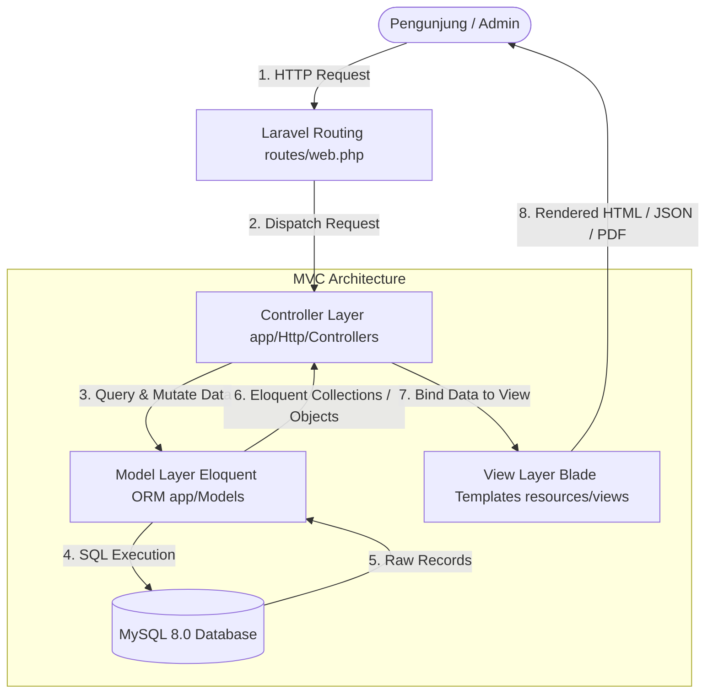

# Product Requirement Document (PRD)
## Sistem Informasi & Manajemen Konten (CMS) Admin
### Arsitektur: Model-View-Controller (MVC) | Framework: Laravel 11
### Yayasan Natural Kapital Indonesia (YNKI)

---

## 1. Ringkasan Eksekutif (Executive Summary)
Dokumen ini mendefinisikan kebutuhan fungsional, spesifikasi teknis, dan rancangan arsitektur berorientasi **Model-View-Controller (MVC)** untuk pengembangan **Sistem Informasi & Admin CMS Yayasan Natural Kapital Indonesia (YNKI)** berbasis **Framework Laravel 11 (PHP 8.2+)**. Sistem ini memisahkan logika bisnis (*Model*), antarmuka pengguna (*View*), dan penanganan alur permintaan (*Controller*) secara modular, terisolasi dalam container **Docker** (*Nginx + PHP-FPM + MySQL*).

---

## 2. Pola Arsitektur MVC (Model-View-Controller Pattern)

Sistem dibangun dengan pemisahan tanggung jawab (*Separation of Concerns*) sesuai standar arsitektur MVC:



### 2.1. Tanggung Jawab Komponen MVC:
1. **Model (`app/Models/`)**:
   - Merepresentasikan entitas data dan struktur tabel database.
   - Mengelola relasi data antar tabel (*One to Many, Belongs To, Many to Many*).
   - Menjalankan *Business Logic*, validasi data tingkat model, *Accessors*, *Mutators*, dan *Query Scopes*.
2. **View (`resources/views/`)**:
   - Menyajikan antarmuka visual kepada pengguna menggunakan *Blade Templating Engine*.
   - Tidak memuat logika bisnis atau pemanggilan query database langsung.
   - Terbagi menjadi 2 modul utama: **Public Views** (Website YNKI) dan **Admin Views** (Panel Dashboard & Formulir CRUD).
3. **Controller (`app/Http/Controllers/`)**:
   - Menjembatani permintaan dari *Route/URL* ke *Model* dan meneruskan datanya ke *View*.
   - Mengontrol validasi input (*Form Request Validation*), autorisasi aksi, upload file storage, dan pembuatan respon (HTML / Download Excel / Generate PDF).

---

## 3. Rincian Lapisan MVC (MVC Layer Details)

### 3.1. Lapisan Model (`app/Models/`)

| File Model | Tabel Terkait | Deskripsi & Relasi Eloquent |
| :--- | :--- | :--- |
| **`User.php`** | `users` | Akun admin. Relasi: `hasMany(Article)`, `hasMany(Donation, 'verified_by')`, `hasMany(ActivityLog)`. |
| **`DonationAccount.php`** | `donation_accounts` | Rekening bank/QRIS tujuan donasi. Relasi: `hasMany(Donation)`. Scope: `scopeActive()`. |
| **`DonationProgram.php`** | `donation_programs` | Program donasi (Restorasi Gambut, dll.). Relasi: `hasMany(Donation)`. |
| **`Donation.php`** | `donations` | Transaksi donasi. Relasi: `belongsTo(DonationAccount)`, `belongsTo(DonationProgram)`, `belongsTo(User, 'verified_by_user_id')`. |
| **`TeamCategory.php`** | `team_categories` | Kategori struktur organisasi (Pembina, Pengawas, Harian). Relasi: `hasMany(TeamMember)`. |
| **`TeamMember.php`** | `team_members` | Profil anggota pengurus/tim. Relasi: `belongsTo(TeamCategory)`. Scope: `scopeActive()`. |
| **`ArticleCategory.php`** | `article_categories`| Kategori artikel/publikasi. Relasi: `hasMany(Article)`. |
| **`Article.php`** | `articles` | Artikel berita, riset, kisah. Relasi: `belongsTo(ArticleCategory)`, `belongsTo(User, 'author_id')`. Scope: `scopePublished()`. |
| **`ActivityLog.php`** | `activity_logs` | Catatan audit aktivitas admin. Relasi: `belongsTo(User)`. |

### 3.2. Lapisan Controller (`app/Http/Controllers/`)

```
app/Http/Controllers/
├── Auth/
│   └── LoginController.php             # Menangani form & aksi login tersembunyi (/login)
├── Public/
│   ├── HomeController.php              # Menampilkan beranda dan profil YNKI
│   ├── PublicDonationController.php    # Menampilkan rekening aktif & proses submit donasi
│   ├── PublicArticleController.php     # Menampilkan daftar & detail artikel/riset
│   └── PublicTeamController.php        # Menampilkan struktur tim & pengurus dinamis
└── Admin/
    ├── DashboardController.php         # Menampilkan widget statistik donasi & konten
    ├── DonationAccountController.php   # CRUD rekening bank & upload QRIS
    ├── DonationController.php          # Verifikasi donasi, validasi bukti transfer
    ├── TeamMemberController.php        # CRUD pengurus YNKI & upload foto profil
    ├── ArticleController.php           # CRUD artikel publikasi & upload riset PDF
    └── ReportController.php            # Ekspor laporan donasi ke format Excel & PDF
```

### 3.3. Lapisan View (`resources/views/`)

```
resources/views/
├── layouts/
│   ├── app.blade.php                   # Master layout publik (Header, Nav, Footer YNKI)
│   ├── admin.blade.php                 # Master layout panel admin (Sidebar, Topbar)
│   └── auth.blade.php                  # Layout minimalis untuk form login tersembunyi
├── public/
│   ├── home.blade.php                  # Halaman beranda utama
│   ├── donation.blade.php              # Halaman formulir & info rekening donasi
│   ├── team.blade.php                  # Halaman daftar tim & pengurus YNKI
│   └── articles/
│       ├── index.blade.php             # Katalog artikel & publikasi riset
│       └── show.blade.php              # Halaman detail baca artikel
├── auth/
│   └── login.blade.php                 # Formulir login admin (Akses via /login)
├── admin/
│   ├── dashboard.blade.php             # Dashboard metrik & statistik
│   ├── accounts/                       # View CRUD Rekening Bank (index, create, edit)
│   ├── donations/                      # View Daftar Donasi & Modal Verifikasi
│   ├── teams/                          # View CRUD Pengurus YNKI
│   ├── articles/                       # View CRUD Artikel & WYSIWYG Editor
│   └── reports/                        # View Filter & Download Laporan
└── pdf/
    └── donation_report.blade.php       # Template PDF resmi ber-kop YNKI
```

---

## 4. Kebutuhan Fungsional Sistem (Functional Specs)

### 4.1. Modul Autentikasi Tersembunyi (Hidden Login Portal)
* **Akses URL**: Tidak disediakan tautan login pada navbar/footer publik. Login diakses langsung via `localhost:8000/login` atau `https://naturalkapital.or.id/login`.
* **Controller**: `Auth\LoginController.php`.
* **View**: `auth/login.blade.php`.
* **Keamanan**: Middleware `guest`, CSRF Token `@csrf`, proteksi brute force `throttle:5,1`.

### 4.2. Modul Rekening & Rekening Donasi
* **Controller**: `Admin\DonationAccountController.php`.
* **Model**: `App\Models\DonationAccount.php`.
* **Fitur**: Tambah/Edit/Hapus bank, nomor rekening, atas nama, dan unggah QRIS (JPEG/PNG).

### 4.3. Modul Donasi & Bukti Transfer
* **Controller**: `Public\PublicDonationController.php` (Submit) & `Admin\DonationController.php` (Kelola).
* **Model**: `App\Models\Donation.php`.
* **Fitur**:
  * Donatur mengisi form publik, memilih program & rekening, lalu mengunggah struk transfer.
  * Admin meninjau struk pembayaran di dashboard dan mengubah status (`Verified` / `Rejected`).

### 4.4. Modul Tim & Pengurus YNKI
* **Controller**: `Admin\TeamMemberController.php`.
* **Model**: `App\Models\TeamMember.php` & `App\Models\TeamCategory.php`.
* **Fitur**: Kelola nama, gelar, jabatan, kategori posisi, foto WebP, biografi, nomor urut tampilan.

### 4.5. Modul Konten Artikel & Laporan Riset
* **Controller**: `Admin\ArticleController.php`.
* **Model**: `App\Models\Article.php` & `App\Models\ArticleCategory.php`.
* **Fitur**: Pembuatan artikel dengan WYSIWYG Editor, upload gambar sampul, upload lampiran PDF riset, manajemen kategori, auto-slug SEO.

### 4.6. Modul Laporan (Reporting & Export)
* **Controller**: `Admin\ReportController.php`.
* **Library**: `Maatwebsite\Excel` (Export Excel `.xlsx`) & `Barryvdh\DomPDF` (Generate PDF).
* **Fitur**: Filter data donasi berdasarkan tanggal atau program, lalu unduh dokumen rekapitulasi.

---

## 5. Skema Relasi Database MySQL & Laravel Migrations

```sql
-- DDL Database MySQL YNKI
CREATE DATABASE IF NOT EXISTS ynki_db CHARACTER SET utf8mb4 COLLATE utf8mb4_unicode_ci;
USE ynki_db;

-- 1. Tabel Users (Admin)
CREATE TABLE users (
    id BIGINT UNSIGNED AUTO_INCREMENT PRIMARY KEY,
    name VARCHAR(100) NOT NULL,
    email VARCHAR(100) NOT NULL UNIQUE,
    password VARCHAR(255) NOT NULL,
    role ENUM('superadmin', 'finance', 'editor') NOT NULL DEFAULT 'editor',
    status ENUM('active', 'inactive') NOT NULL DEFAULT 'active',
    remember_token VARCHAR(100) NULL,
    created_at TIMESTAMP NULL,
    updated_at TIMESTAMP NULL
) ENGINE=InnoDB;

-- 2. Tabel Donation Accounts
CREATE TABLE donation_accounts (
    id BIGINT UNSIGNED AUTO_INCREMENT PRIMARY KEY,
    bank_name VARCHAR(100) NOT NULL,
    account_number VARCHAR(50) NOT NULL,
    account_holder VARCHAR(150) NOT NULL,
    branch_name VARCHAR(100) NULL,
    qris_image_path VARCHAR(255) NULL,
    instructions TEXT NULL,
    is_active BOOLEAN DEFAULT TRUE,
    created_at TIMESTAMP NULL,
    updated_at TIMESTAMP NULL
) ENGINE=InnoDB;

-- 3. Tabel Donation Programs
CREATE TABLE donation_programs (
    id BIGINT UNSIGNED AUTO_INCREMENT PRIMARY KEY,
    program_name VARCHAR(150) NOT NULL,
    slug VARCHAR(180) NOT NULL UNIQUE,
    description TEXT NULL,
    target_amount DECIMAL(15,2) DEFAULT 0.00,
    collected_amount DECIMAL(15,2) DEFAULT 0.00,
    is_active BOOLEAN DEFAULT TRUE,
    created_at TIMESTAMP NULL,
    updated_at TIMESTAMP NULL
) ENGINE=InnoDB;

-- 4. Tabel Donations
CREATE TABLE donations (
    id BIGINT UNSIGNED AUTO_INCREMENT PRIMARY KEY,
    invoice_number VARCHAR(50) NOT NULL UNIQUE,
    donor_name VARCHAR(150) NOT NULL,
    donor_email VARCHAR(100) NOT NULL,
    donor_phone VARCHAR(30) NULL,
    is_anonymous BOOLEAN DEFAULT FALSE,
    amount DECIMAL(15,2) NOT NULL,
    program_id BIGINT UNSIGNED NULL,
    donation_account_id BIGINT UNSIGNED NOT NULL,
    transfer_proof_path VARCHAR(255) NULL,
    donor_notes TEXT NULL,
    status ENUM('pending', 'verified', 'rejected') NOT NULL DEFAULT 'pending',
    verified_by_user_id BIGINT UNSIGNED NULL,
    verified_at TIMESTAMP NULL,
    rejection_reason VARCHAR(255) NULL,
    created_at TIMESTAMP NULL,
    updated_at TIMESTAMP NULL,
    FOREIGN KEY (program_id) REFERENCES donation_programs(id) ON DELETE SET NULL,
    FOREIGN KEY (donation_account_id) REFERENCES donation_accounts(id) ON DELETE RESTRICT,
    FOREIGN KEY (verified_by_user_id) REFERENCES users(id) ON DELETE SET NULL
) ENGINE=InnoDB;

-- 5. Tabel Team Categories & Members
CREATE TABLE team_categories (
    id BIGINT UNSIGNED AUTO_INCREMENT PRIMARY KEY,
    category_name VARCHAR(100) NOT NULL,
    sort_order INT DEFAULT 0,
    created_at TIMESTAMP NULL,
    updated_at TIMESTAMP NULL
) ENGINE=InnoDB;

CREATE TABLE team_members (
    id BIGINT UNSIGNED AUTO_INCREMENT PRIMARY KEY,
    category_id BIGINT UNSIGNED NOT NULL,
    full_name VARCHAR(150) NOT NULL,
    position VARCHAR(100) NOT NULL,
    bio TEXT NULL,
    photo_path VARCHAR(255) NULL,
    linkedin_url VARCHAR(255) NULL,
    email VARCHAR(100) NULL,
    sort_order INT DEFAULT 0,
    status ENUM('active', 'alumni') NOT NULL DEFAULT 'active',
    created_at TIMESTAMP NULL,
    updated_at TIMESTAMP NULL
    FOREIGN KEY (category_id) REFERENCES team_categories(id) ON DELETE CASCADE
) ENGINE=InnoDB;

-- 6. Tabel Article Categories & Articles
CREATE TABLE article_categories (
    id BIGINT UNSIGNED AUTO_INCREMENT PRIMARY KEY,
    category_name VARCHAR(100) NOT NULL,
    slug VARCHAR(120) NOT NULL UNIQUE,
    description VARCHAR(255) NULL,
    created_at TIMESTAMP NULL,
    updated_at TIMESTAMP NULL
) ENGINE=InnoDB;

CREATE TABLE articles (
    id BIGINT UNSIGNED AUTO_INCREMENT PRIMARY KEY,
    category_id BIGINT UNSIGNED NOT NULL,
    author_id BIGINT UNSIGNED NOT NULL,
    title VARCHAR(255) NOT NULL,
    slug VARCHAR(280) NOT NULL UNIQUE,
    excerpt TEXT NULL,
    content LONGTEXT NOT NULL,
    featured_image_path VARCHAR(255) NULL,
    attachment_pdf_path VARCHAR(255) NULL,
    views_count BIGINT UNSIGNED DEFAULT 0,
    status ENUM('draft', 'published', 'archived') NOT NULL DEFAULT 'draft',
    published_at TIMESTAMP NULL,
    created_at TIMESTAMP NULL,
    updated_at TIMESTAMP NULL,
    FOREIGN KEY (category_id) REFERENCES article_categories(id) ON DELETE RESTRICT,
    FOREIGN KEY (author_id) REFERENCES users(id) ON DELETE CASCADE
) ENGINE=InnoDB;

-- 7. Tabel Activity Logs
CREATE TABLE activity_logs (
    id BIGINT UNSIGNED AUTO_INCREMENT PRIMARY KEY,
    user_id BIGINT UNSIGNED NOT NULL,
    action VARCHAR(100) NOT NULL,
    module VARCHAR(50) NOT NULL,
    record_id BIGINT UNSIGNED NULL,
    details TEXT NULL,
    ip_address VARCHAR(45) NULL,
    user_agent VARCHAR(255) NULL,
    created_at TIMESTAMP NULL,
    updated_at TIMESTAMP NULL,
    FOREIGN KEY (user_id) REFERENCES users(id) ON DELETE CASCADE
) ENGINE=InnoDB;
```

---

## 6. Konfigurasi Kontainerisasi Docker (Laravel MVC)

### 6.1. `docker-compose.yml`
```yaml
version: '3.8'

services:
  # App Service: Laravel PHP-FPM
  ynki-app:
    build:
      context: .
      dockerfile: docker/php/Dockerfile
    container_name: ynki_laravel_app
    restart: unless-stopped
    working_dir: /var/www/html
    volumes:
      - ./:/var/www/html
      - ./docker/php/local.ini:/usr/local/etc/php/conf.d/local.ini
    environment:
      DB_HOST: ynki-db
      DB_PORT: 3306
      DB_DATABASE: ynki_db
      DB_USERNAME: ynki_user
      DB_PASSWORD: secure_ynki_password_2026
    networks:
      - ynki-network
    depends_on:
      - ynki-db

  # Web Server: Nginx
  ynki-nginx:
    image: nginx:alpine
    container_name: ynki_nginx_web
    restart: unless-stopped
    ports:
      - "8000:80"
    volumes:
      - ./:/var/www/html
      - ./docker/nginx/conf.d/app.conf:/etc/nginx/conf.d/default.conf
    networks:
      - ynki-network
    depends_on:
      - ynki-app

  # Database Service: MySQL 8.0
  ynki-db:
    image: mysql:8.0
    container_name: ynki_mysql_db
    restart: unless-stopped
    environment:
      MYSQL_DATABASE: ynki_db
      MYSQL_USER: ynki_user
      MYSQL_PASSWORD: secure_ynki_password_2026
      MYSQL_ROOT_PASSWORD: root_ynki_password_2026
    ports:
      - "3306:3306"
    volumes:
      - ynki_db_data:/var/lib/mysql
    networks:
      - ynki-network

volumes:
  ynki_db_data:
    driver: local

networks:
  ynki-network:
    driver: bridge
```

---

## 7. Rute Aplikasi MVC (`routes/web.php`)

```php
<?php

use Illuminate\Support\Facades\Route;
use App\Http\Controllers\Auth\LoginController;
use App\Http\Controllers\Public\HomeController;
use App\Http\Controllers\Public\PublicDonationController;
use App\Http\Controllers\Public\PublicArticleController;
use App\Http\Controllers\Public\PublicTeamController;
use App\Http\Controllers\Admin\DashboardController;
use App\Http\Controllers\Admin\DonationAccountController;
use App\Http\Controllers\Admin\DonationController;
use App\Http\Controllers\Admin\TeamMemberController;
use App\Http\Controllers\Admin\ArticleController;
use App\Http\Controllers\Admin\ReportController;

/*
|--------------------------------------------------------------------------
| 1. Rute Publik (Akses Pengunjung YNKI)
|--------------------------------------------------------------------------
*/
Route::get('/', [HomeController::class, 'index'])->name('public.home');
Route::get('/tentang-kami/tim-pengurus', [PublicTeamController::class, 'index'])->name('public.team');
Route::get('/donasi', [PublicDonationController::class, 'index'])->name('public.donation');
Route::post('/donasi', [PublicDonationController::class, 'store'])->name('public.donation.store');
Route::get('/artikel', [PublicArticleController::class, 'index'])->name('public.article.index');
Route::get('/artikel/{slug}', [PublicArticleController::class, 'show'])->name('public.article.show');

/*
|--------------------------------------------------------------------------
| 2. Hidden Login Route (Tanpa tombol navigasi di website publik)
|--------------------------------------------------------------------------
*/
Route::middleware('guest')->group(function () {
    Route::get('/login', [LoginController::class, 'showLoginForm'])->name('login');
    Route::post('/login', [LoginController::class, 'login'])->middleware('throttle:5,1');
});
Route::post('/logout', [LoginController::class, 'logout'])->middleware('auth')->name('logout');

/*
|--------------------------------------------------------------------------
| 3. Panel Admin CMS (Dilindungi Auth Middleware)
|--------------------------------------------------------------------------
*/
Route::prefix('admin')->middleware(['auth'])->name('admin.')->group(function () {
    Route::get('/dashboard', [DashboardController::class, 'index'])->name('dashboard');
    
    // CRUD Rekening Bank / QRIS Donasi
    Route::resource('accounts', DonationAccountController::class);
    
    // Verifikasi Transaksi Donasi
    Route::get('donations', [DonationController::class, 'index'])->name('donations.index');
    Route::get('donations/{id}', [DonationController::class, 'show'])->name('donations.show');
    Route::patch('donations/{id}/verify', [DonationController::class, 'verify'])->name('donations.verify');
    Route::patch('donations/{id}/reject', [DonationController::class, 'reject'])->name('donations.reject');
    
    // CRUD Tim & Pengurus YNKI
    Route::resource('teams', TeamMemberController::class);
    
    // CRUD Artikel Berita & Dokumen Riset
    Route::resource('articles', ArticleController::class);
    
    // Pelaporan & Ekspor
    Route::get('reports/donations/excel', [ReportController::class, 'exportDonationsExcel'])->name('reports.donations.excel');
    Route::get('reports/donations/pdf', [ReportController::class, 'exportDonationsPdf'])->name('reports.donations.pdf');
});
```

---

## 8. Panduan Menjalankan Sistem (Getting Started)

```bash
# 1. Masuk ke direktori proyek & salin .env
cp .env.example .env

# 2. Build & jalankan kontainer Docker (Nginx, PHP-FPM, MySQL)
docker compose up -d --build

# 3. Install vendor package via Composer dalam kontainer
docker compose exec ynki-app composer install

# 4. Generate App Key Laravel
docker compose exec ynki-app php artisan key:generate

# 5. Jalankan Migrasi Tabel & Seeder Akun Super Admin Awal
docker compose exec ynki-app php artisan migrate --seed

# 6. Hubungkan Storage Upload Gambar
docker compose exec ynki-app php artisan storage:link

# 7. Selesai! Buka di browser:
#    - Website Publik : http://localhost:8000/
#    - Login Admin    : http://localhost:8000/login
```
